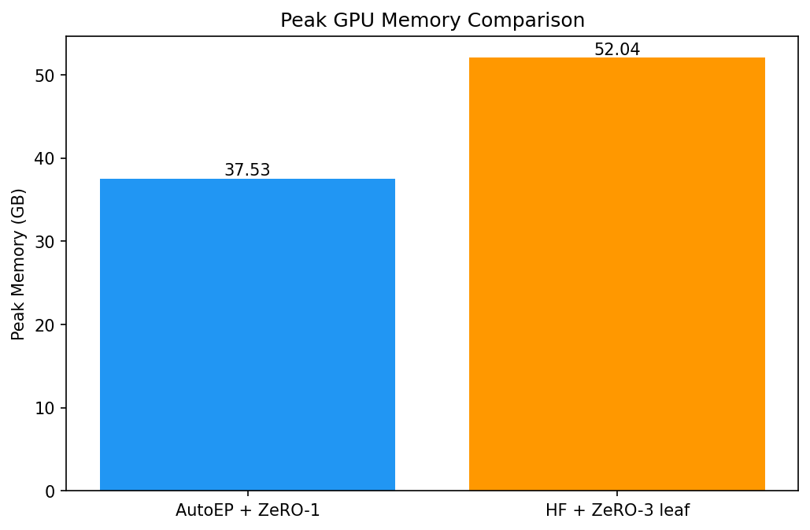
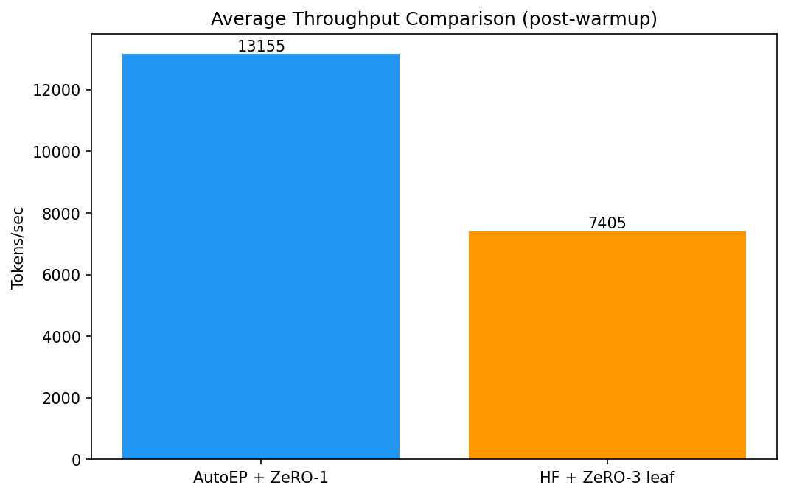

# AutoEP Training Example

This example demonstrates **Auto Expert Parallelism (AutoEP)** in DeepSpeed by comparing training loss curves, peak GPU memory, and throughput between two modes:

- **AutoEP + ZeRO-1**: DeepSpeed automatically replaces MoE layers with expert-parallel versions
- **HF + ZeRO-3 leaf modules**: native HuggingFace MoE with ZeRO-3 leaf-module optimization (baseline)

## What is AutoEP?

AutoEP (Auto Expert Parallelism) automatically partitions MoE expert weights across GPUs and uses AllToAll communication to route tokens to the correct experts. It follows the same module-injection UX as AutoTP, replacing MoE layers at `deepspeed.initialize()` time.

Key properties:
- Experts are distributed across `autoep_size` GPUs within each EP group
- AutoEP currently supports ZeRO stages 0, 1, and 2 (**not ZeRO-3**)
- The validation workflow in this example uses a shared init-weights artifact so both modes start from identical HF weights

## Quick Start

### Prerequisites

- 2+ GPUs (8xH100 recommended)
- DeepSpeed installed from an AutoEP-enabled branch that includes the expert-gradient predivide fix, for example `fix/fix-autoep-zero2-expert-grad-predivide` at `fae0276f4ff1ebd7c8a30a7d07068f3850e00df3`
- `transformers >= 4.44.0`

### Install

```bash
pip install -r requirements.txt
cd /path/to/DeepSpeed && pip install -e .
```

### Run individual modes (same-init parity workflow)

For correctness comparisons, seed parity alone is not enough. Generate one shared init-weights artifact and load it in both modes.

```bash
# 1) Generate shared init weights artifact (single-process, no deepspeed launcher)
python train_compare.py \
    --mode autoep \
    --deepspeed_config configs/ds_autoep_zero1.json \
    --num_layers 4 \
    --seed 42 \
    --init_weights_only \
    --save_init_weights /mnt/local_storage/autoep_results/init_weights.safetensors

# 2) AutoEP + ZeRO-1
deepspeed --num_gpus 8 train_compare.py \
    --mode autoep \
    --deepspeed_config configs/ds_autoep_zero1.json \
    --num_layers 4 \
    --steps 1000 \
    --load_init_weights /mnt/local_storage/autoep_results/init_weights.safetensors

# 3) HF + ZeRO-3 leaf (baseline), loading the same artifact
deepspeed --num_gpus 8 train_compare.py \
    --mode zero3_leaf \
    --deepspeed_config configs/ds_zero3_leaf.json \
    --num_layers 4 \
    --steps 1000 \
    --load_init_weights /mnt/local_storage/autoep_results/init_weights.safetensors
```

The init artifact is mode-agnostic. You can generate it with either mode and load it in either mode because it stores pre-DeepSpeed HF model weights.

### Run full comparison pipeline

```bash
bash run_compare.sh \
    --num_gpus 8 \
    --steps 1000 \
    --out_dir /mnt/local_storage/autoep_results \
    --init_weights_path /mnt/local_storage/autoep_results/init_weights.safetensors
```

This will:
1. Optionally binary-search for the maximum feasible shared layer count
2. Generate shared init weights once
3. Run full training at the determined layer count in both modes with `--load_init_weights`
4. Run `compare_metrics.py --require_same_init_hash` and generate loss, memory, and throughput outputs

### Init artifact storage guidance

- Save init artifacts under `/mnt/local_storage/` (not your home dir)
- Keep the sidecar metadata file `init_weights_meta.json` next to the `.safetensors` file
- The 8-layer validated run in this README produced an init artifact of about `45 GB`, so plan local storage accordingly
- After a comparison finishes, the artifact is safe to delete because the metadata and summary retain the SHA-256 provenance

## Model

Uses a randomly-initialized Mixtral architecture with configurable layer count:
- `num_local_experts`: 8 (total experts per MoE layer)
- `num_experts_per_tok`: 2 (top-k routing)
- `hidden_size`: 4096 (original Mixtral-8x7B)
- `intermediate_size`: 14336 (original Mixtral-8x7B)
- `num_attention_heads`: 32 (original Mixtral-8x7B)
- Reduced layer count for feasibility on available hardware

AutoEP routing configuration (Mixtral preset):
- `score_func`: softmax
- `score_apply`: post (scores applied via `bmm` in `combine_from_routed`)
- `route_norm`: true (top-k scores renormalized to sum to 1)

## Configuration

### AutoEP config (`configs/ds_autoep_zero1.json`)

- `bf16.enabled: true`
- `zero_optimization.stage: 1`
- `expert_parallel.enabled: true`
- `expert_parallel.autoep_size: 4`
- `expert_parallel.preset_model: "mixtral"`
- `expert_parallel.load_balance_coeff: null`

### ZeRO-3 leaf config (`configs/ds_zero3_leaf.json`)

- `bf16.enabled: true`
- `zero_optimization.stage: 3`
- `zero_optimization.leaf_module.classes`: `["transformers.models.mixtral.modeling_mixtral.MixtralSparseMoeBlock"]`

Both configs use AdamW with `lr=1e-4` and otherwise rely on optimizer defaults, plus a `WarmupCosineLR` scheduler (100-step linear warmup, cosine decay to 0.1% of peak over 1000 steps).

## Important Constraints

### `autoep_size` requirements

- Must be `<= num_experts` (8 for the default Mixtral config)
- Must evenly divide `num_experts`
- Must evenly divide `world_size` (or `stage_size` with pipeline parallelism)
- `autoep_size=1` bypasses EP communication entirely (degenerate case)

### Effective batch size

This example records `effective_tokens_per_update` from runtime metadata using `engine.dp_world_size`. In the validated 8xH100 run below, both modes reported:

- `dp_world_size = 8`
- `effective_tokens_per_update = 2048`

Use the metadata files as the source of truth for effective batch size instead of inferring it from `autoep_size` alone.

### bf16 requirement

`bf16` is recommended. `fp16` is functionally correct but not optimized for the Hopper grouped-GEMM fast path used by `torch._grouped_mm`.

### Optimizer wiring

AutoEP runs must let DeepSpeed build the optimizer from the JSON config (no client optimizer). This ensures `configure_moe_param_groups()` is invoked to split expert parameters into expert-data-parallel reduction groups.

### Load balancing status

`load_balance_coeff` is accepted in config but the bias update pre-hook is **not yet implemented**. Setting it has no runtime effect (`expert_bias` stays at zero). The `AutoEPConfig` default is `1e-3`, so explicitly set `null` to avoid registering an unused buffer.

## Interpreting Results

### Loss curves

The primary comparison uses CE-only loss (`output_router_logits=False`). Small divergence between modes is expected due to:
- Different ZeRO stages causing different floating-point reduction order
- Expert computation using grouped GEMM vs sequential dispatch
- Different optimizer/state partitioning behavior across the two runtime stacks

Acceptance criterion: trend agreement, not bit-identical values.

### Memory

Peak memory reflects the full runtime stack (AutoEP + ZeRO-1 vs HF + ZeRO-3 leaf), not an isolated EP effect. ZeRO-3 partitions all parameters; AutoEP partitions expert parameters while running with ZeRO-1.

### Throughput

Throughput includes communication differences from both AutoEP (AllToAll routing for MoE layers) and ZeRO-stage internals.

**These are characterizations of the full runtime stacks, not isolated AutoEP benchmarks.**

### Grouped GEMM backend

`torch._grouped_mm` is required for production performance. Without it, the code falls back to a sequential for-loop over experts. On A100 (SM80), verify availability and actual throughput since the Hopper fast path may not activate.

### Wall-clock breakdown

`engine.print_forward_breakdown()` does not report gate or MoE timing for AutoEP runs because `gate_modules` and `moe_layers` are empty for AutoEP. Rely on the per-step timing metrics from this example instead.

## Metric Definitions

- **loss_ce**: DP-mean CE loss (`all_reduce(SUM) / dp_world_size`)
- **peak memory**: max across all ranks (not rank-0 only)
- **iter_time_sec**: cross-rank max per optimizer step (includes all gradient-accumulation microsteps)
- **global_tokens_per_sec**: `seq_len * micro_batch_size * grad_accum * dp_world_size / iter_time_sec`

## Reproducibility

Each run writes a metadata JSON file containing:
- DeepSpeed git SHA and branch when discoverable from the local checkout
- Package versions (`torch`, `transformers`, `deepspeed`)
- CUDA runtime, NCCL version, and driver version
- Launch topology (`world_size`, `dp_world_size`, `autoep_size`)
- Effective tokens per optimizer update
- Init artifact provenance:
  - `init_weights_path`
  - `init_weights_sha256`
  - `init_weights_loaded`
  - `init_weights_schema_version`

`compare_metrics.py` enforces matching init hashes by default (`--require_same_init_hash`). For legacy metadata without init-hash fields, use `--no_require_same_init_hash`.

## Verified Results (8xH100 80GB, 8-layer Mixtral, `lr=1e-4`)

The commands below reproduce the shared-init comparison validated in run `autoep_example_validate_20260403_070130` (April 3, 2026 UTC). This documented rerun fixes the workflow at 8 layers so it fits the available environment.

### Environment

- 8x NVIDIA H100 80GB HBM3
- Validation run uses 8 transformer layers to fit this environment
- DeepSpeed runtime imported from `fix/fix-autoep-zero2-expert-grad-predivide` at `fae0276f4ff1ebd7c8a30a7d07068f3850e00df3`
- DeepSpeed version string `0.18.10+71a0a36a`
- PyTorch `2.9.1+cu128`
- `transformers 5.1.0`
- NCCL `2.27.5`
- `torch._grouped_mm` available (Hopper grouped-GEMM fast path active)

### Commands

All commands run from `DeepSpeedExamples/training/expert_parallel/`.

```bash
RUN_ROOT=/mnt/local_storage/autoep_example_validate_20260403_070130
```

**Step 1: generate shared initialization artifact**

```bash
python train_compare.py \
    --mode autoep \
    --deepspeed_config configs/ds_autoep_zero1.json \
    --num_layers 8 \
    --seq_len 128 \
    --micro_batch_size 2 \
    --grad_accum 1 \
    --seed 42 \
    --init_weights_only \
    --save_init_weights "$RUN_ROOT/init_weights.safetensors"
```

**Step 2: AutoEP + ZeRO-1**

```bash
deepspeed --num_gpus 8 --master_port 29744 train_compare.py \
    --mode autoep \
    --deepspeed_config configs/ds_autoep_zero1.json \
    --num_layers 8 \
    --steps 1000 \
    --warmup_steps 50 \
    --seq_len 128 \
    --micro_batch_size 2 \
    --grad_accum 1 \
    --seed 42 \
    --load_init_weights "$RUN_ROOT/init_weights.safetensors" \
    --metrics_out "$RUN_ROOT/metrics_autoep.csv" \
    --run_metadata_out "$RUN_ROOT/metadata_autoep.json"
```

**Step 3: HF + ZeRO-3 leaf baseline**

```bash
deepspeed --num_gpus 8 --master_port 29745 train_compare.py \
    --mode zero3_leaf \
    --deepspeed_config configs/ds_zero3_leaf.json \
    --num_layers 8 \
    --steps 1000 \
    --warmup_steps 50 \
    --seq_len 128 \
    --micro_batch_size 2 \
    --grad_accum 1 \
    --seed 42 \
    --load_init_weights "$RUN_ROOT/init_weights.safetensors" \
    --metrics_out "$RUN_ROOT/metrics_zero3_leaf.csv" \
    --run_metadata_out "$RUN_ROOT/metadata_zero3_leaf.json"
```

**Step 4: generate comparison plots and summary**

```bash
python compare_metrics.py \
    --autoep_csv "$RUN_ROOT/metrics_autoep.csv" \
    --zero3_leaf_csv "$RUN_ROOT/metrics_zero3_leaf.csv" \
    --autoep_metadata "$RUN_ROOT/metadata_autoep.json" \
    --zero3_leaf_metadata "$RUN_ROOT/metadata_zero3_leaf.json" \
    --out_dir "$RUN_ROOT/results" \
    --out_json "$RUN_ROOT/results/summary.json" \
    --autoep_label "AutoEP + ZeRO-1" \
    --zero3_leaf_label "HF + ZeRO-3 leaf" \
    --warmup_steps 50 \
    --require_same_init_hash
```

### Observed Results

#### Loss curve


#### Peak memory



#### Throughput



| Metric | AutoEP + ZeRO-1 | HF + ZeRO-3 leaf |
|--------|------------------|-------------------|
| Final loss (step 999) | 10.405 | 11.058 |
| Peak GPU memory | 37.53 GB | 52.04 GB |
| Avg throughput (post-warmup) | 13,155 tok/s | 7,405 tok/s |

| Comparison metric | Value |
|-------------------|-------|
| Final abs loss diff | 0.6530 |
| Last 100-step mean abs loss diff | 0.6860 |
| Mean abs loss diff (950 aligned steps) | 0.3246 |
| Max abs loss diff | 0.7435 |
| Pearson correlation | 0.6001 |
| Memory ratio (autoep/zero3) | 0.72x |
| Throughput ratio (autoep/zero3) | 1.78x |
| Same init hash | true |

**Key takeaways:**

- **Both modes completed from identical initialization weights, but the 8-layer fit-to-environment run diverges more at `lr=1e-4`**: final-step loss differs by `0.6530`, the last-100-step mean absolute loss difference is `0.6860`, and Pearson correlation is `0.6001`.
- **AutoEP uses about 27.9% less peak memory** with 4-way expert partitioning, confirmed by validation: `local=2.82B` expert params, `global_est=11.27B`, `partition_ratio=4.0`.
- **AutoEP is about 1.78x faster** in this smaller configuration: `13,155 tok/s` vs `7,405 tok/s`.
- **Both modes used the same effective batch size**: `128 seq_len * 2 mbs * 1 grad_accum * 8 dp_world_size = 2048 tokens/update`.

**Note:** These are characterizations of the full runtime stacks (AutoEP + ZeRO-1 vs HF + ZeRO-3 leaf), not isolated AutoEP-only benchmarks. Memory and throughput differences include ZeRO-stage effects.

## Troubleshooting

### Leaf-module misconfiguration

If ZeRO-3 leaf mode fails, verify `transformers.models.mixtral.modeling_mixtral.MixtralSparseMoeBlock` matches your installed `transformers` version.

### OOM errors

Reduce `--num_layers` or `--micro_batch_size`. Use `find_max_layers.py` to automatically find the largest feasible configuration.

### Sequential GEMM fallback warning

If you see `Sequential expert for-loop fallback is active`, `torch._grouped_mm` is unavailable. Update PyTorch or check hardware compatibility.

### Effective batch size mismatch

Use `--target_global_tokens_per_update` carefully and validate `effective_tokens_per_update` from the emitted metadata files. The metadata is the source of truth for this example.

### Zero-token expert warnings

With small batch sizes, some experts may receive zero tokens after AllToAll dispatch. This is handled gracefully via alignment padding and is not an error.
