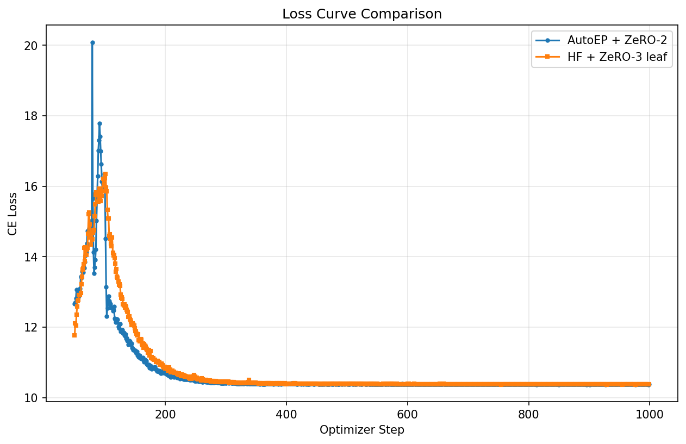

# AutoEP Training Example

This example demonstrates **Auto Expert Parallelism (AutoEP)** in DeepSpeed by comparing training loss curves, peak GPU memory, and throughput between two modes:

- **AutoEP + ZeRO-2**: DeepSpeed automatically replaces MoE layers with expert-parallel versions
- **HF + ZeRO-3 leaf modules**: Native HuggingFace MoE with ZeRO-3 leaf-module optimization (baseline)

## What is AutoEP?

AutoEP (Auto Expert Parallelism) automatically partitions MoE expert weights across GPUs and uses AllToAll communication to route tokens to the correct experts. It follows the same module-injection UX as AutoTP, replacing MoE layers at `deepspeed.initialize()` time.

Key properties:
- Experts are distributed across `autoep_size` GPUs within each EP group
- Data parallelism world size becomes `world_size / autoep_size` when EP is active
- Currently supports ZeRO stages 0, 1, and 2 (**not ZeRO-3**)

## Quick Start

### Prerequisites

- 2+ GPUs (8xH100 recommended)
- DeepSpeed from `tohtana/add_autoep` branch (editable install)
- `transformers >= 4.44.0`

### Install

```bash
pip install -r requirements.txt
cd /path/to/DeepSpeed && pip install -e .
```

### Run individual modes

```bash
# AutoEP + ZeRO-2
deepspeed --num_gpus 8 train_compare.py \
    --mode autoep \
    --deepspeed_config configs/ds_autoep_zero2.json \
    --num_layers 4 --steps 1000

# HF + ZeRO-3 leaf (baseline)
deepspeed --num_gpus 8 train_compare.py \
    --mode zero3_leaf \
    --deepspeed_config configs/ds_zero3_leaf.json \
    --num_layers 4 --steps 1000
```

### Run full comparison pipeline

```bash
bash run_compare.sh --num_gpus 8 --steps 1000 --out_dir /mnt/local_storage/autoep_results
```

This will:
1. Binary-search for the maximum feasible layer count in both modes
2. Run full training at the determined layer count
3. Generate loss curve, memory, and throughput comparison plots

## Model

Uses a randomly-initialized Mixtral architecture with configurable layer count:
- `num_local_experts`: 8 (total experts per MoE layer)
- `num_experts_per_tok`: 2 (top-k routing)
- `hidden_size`: 4096 (original Mixtral-8x7B)
- `intermediate_size`: 14336 (original Mixtral-8x7B)
- `num_attention_heads`: 32 (original Mixtral-8x7B)
- Reduced layer count for feasibility on available hardware

AutoEP routing configuration (Mixtral preset):
- `score_func`: softmax
- `score_apply`: post (scores applied via bmm in combine_from_routed)
- `route_norm`: True (top-k scores renormalized to sum to 1)

## Configuration

### AutoEP config (`configs/ds_autoep_zero2.json`)

- `bf16.enabled: true`
- `zero_optimization.stage: 2`
- `expert_parallel.enabled: true`
- `expert_parallel.autoep_size: 4`
- `expert_parallel.preset_model: "mixtral"`
- `expert_parallel.load_balance_coeff: null`

### ZeRO-3 leaf config (`configs/ds_zero3_leaf.json`)

- `bf16.enabled: true`
- `zero_optimization.stage: 3`
- `zero_optimization.leaf_module.classes`: `["transformers.models.mixtral.modeling_mixtral.MixtralSparseMoeBlock"]`

Both configs use identical AdamW optimizer settings (lr=3e-3, weight_decay=0.01) with a `WarmupCosineLR` scheduler (100-step linear warmup, cosine decay to 0.1% of peak over 1000 steps).

## Important Constraints

### `autoep_size` requirements

- Must be <= `num_experts` (8 for default Mixtral config)
- Must evenly divide `num_experts`
- Must evenly divide `world_size` (or `stage_size` with pipeline parallelism)
- `autoep_size=1` bypasses EP communication entirely (degenerate case)

### `dp_world_size` with EP

When EP is active, `dp_world_size = world_size / autoep_size`. This affects effective batch size: `effective_tokens_per_update = seq_len * micro_batch_size * grad_accum * dp_world_size`.

### bf16 requirement

`bf16` is recommended. `fp16` is functionally correct but not optimized for the Hopper grouped GEMM fast-path used by `torch._grouped_mm`.

### Optimizer wiring

AutoEP runs must let DeepSpeed build the optimizer from the JSON config (no client optimizer). This ensures `configure_moe_param_groups()` is invoked to split expert parameters into expert-data-parallel reduction groups.

### Load balancing status

`load_balance_coeff` is accepted in config but the bias update pre-hook is **not yet implemented**. Setting it has no runtime effect (expert_bias stays at zero). The `AutoEPConfig` default is `1e-3`, so explicitly set `null` to avoid registering an unused buffer.

## Interpreting Results

### Loss Curves

The primary comparison uses CE-only loss (`output_router_logits=False`). Small divergence between modes is expected due to:
- Different ZeRO stages (2 vs 3) causing different FP reduction order
- Expert computation using grouped GEMM vs sequential dispatch
- `combine_from_routed` index assignment is deterministic (not a divergence source)

Acceptance criterion: trend agreement (similar trajectory shape), not bit-identical values.

### Memory

Peak memory reflects the full runtime stack (AutoEP + ZeRO-2 vs HF + ZeRO-3), not an isolated EP effect. ZeRO-3 partitions all parameters; AutoEP partitions only expert parameters with ZeRO-2.

### Throughput

Throughput includes communication differences from both AutoEP (6L AllToAll calls per step for L MoE layers) and ZeRO-stage internals. AutoEP also adds 2L GPU-CPU synchronizations per forward from `compute_split_plan`.

**These are characterizations of the full runtime stacks, not isolated AutoEP benchmarks.**

### Grouped GEMM Backend

`torch._grouped_mm` is required for production performance. Without it, the code falls back to a sequential for-loop over experts. On A100 (SM80), verify availability and actual throughput since the Hopper fast-path may not activate.

### Wall-clock breakdown

`engine.print_forward_breakdown()` does not report gate/MoE timing for AutoEP runs because `gate_modules` and `moe_layers` are empty for AutoEP. Rely on the per-step timing metrics from this example instead.

## Metric Definitions

- **loss_ce**: DP-mean CE loss (all-reduce SUM / dp_world_size)
- **peak memory**: max across all ranks (not rank-0 only)
- **iter_time_sec**: cross-rank max per optimizer step (includes all gradient accumulation microsteps)
- **global_tokens_per_sec**: `seq_len * micro_batch_size * grad_accum * dp_world_size / iter_time_sec`

## Reproducibility

Each run writes `run_metadata_{mode}.json` containing:
- DeepSpeed git SHA and branch
- Package versions (torch, transformers, deepspeed)
- CUDA runtime, NCCL version, driver version
- Launch topology (world_size, dp_world_size, autoep_size)
- Effective tokens per optimizer update

## Verified Results (8xH100 80GB, 12-layer Mixtral)

The following commands reproduce a full comparison run validated on 2026-02-07.

The model uses original Mixtral-8x7B dimensions (`hidden_size=4096`, `intermediate_size=14336`, `num_attention_heads=32`) with 12 layers — the maximum layer count that fits both modes on 8xH100 80GB (determined by `find_max_layers.py`: AutoEP max=15, ZeRO-3 leaf max=12).

### Environment

- 8x NVIDIA H100 80GB HBM3
- DeepSpeed 0.18.6 (branch `tohtana/add_autoep`)
- PyTorch 2.10.0+cu128
- transformers 5.0.0
- NCCL 2.25.1
- `torch._grouped_mm` available (Hopper grouped GEMM fast-path active)

### Commands

All commands run from `DeepSpeedExamples/training/expert_parallel/`.

**Step 0: Find maximum feasible layer count**

```bash
python find_max_layers.py \
    --output_json /mnt/local_storage/autoep_example_test/layer_search.json \
    --log_dir /mnt/local_storage/autoep_example_test/layer_search/ \
    --num_gpus 8 --master_port 29600 \
    --seq_len 128 --micro_batch_size 2 --grad_accum 1 \
    --trial_steps 20 --trial_timeout 300
```

**Step 1: AutoEP + ZeRO-2**

```bash
deepspeed --num_gpus 8 --master_port 29600 train_compare.py \
    --mode autoep \
    --deepspeed_config configs/ds_autoep_zero2.json \
    --num_layers 12 \
    --steps 1000 \
    --warmup_steps 50 \
    --seq_len 128 \
    --micro_batch_size 2 \
    --grad_accum 1 \
    --seed 42 \
    --metrics_out metrics_autoep.csv \
    --run_metadata_out metadata_autoep.json
```

**Step 2: HF + ZeRO-3 leaf baseline**

```bash
deepspeed --num_gpus 8 --master_port 29600 train_compare.py \
    --mode zero3_leaf \
    --deepspeed_config configs/ds_zero3_leaf.json \
    --num_layers 12 \
    --steps 1000 \
    --warmup_steps 50 \
    --seq_len 128 \
    --micro_batch_size 2 \
    --grad_accum 1 \
    --seed 42 \
    --metrics_out metrics_zero3_leaf.csv \
    --run_metadata_out metadata_zero3_leaf.json
```

**Step 3: Generate comparison plots and summary**

```bash
python compare_metrics.py \
    --autoep_csv metrics_autoep.csv \
    --zero3_leaf_csv metrics_zero3_leaf.csv \
    --autoep_metadata metadata_autoep.json \
    --zero3_leaf_metadata metadata_zero3_leaf.json \
    --out_dir results/ \
    --out_json results/summary.json \
    --warmup_steps 50
```

### Observed Results



| Metric | AutoEP + ZeRO-2 | HF + ZeRO-3 leaf |
|--------|-----------------|-------------------|
| Final loss (step 999) | 10.374 | 10.374 |
| Peak GPU memory | 49.41 GB | 75.36 GB |
| Avg throughput (post-warmup) | 9,054 tok/s | 2,138 tok/s |

| Comparison Metric | Value |
|-------------------|-------|
| Mean abs loss diff | 0.131 |
| Max abs loss diff | 5.584 |
| Pearson correlation | 0.93 |
| Memory ratio (autoep/zero3) | 0.66x |
| Throughput ratio (autoep/zero3) | 4.23x |

**Key takeaways:**

- **Both modes converge to the same final loss** (~10.374) with strong correlation (Pearson 0.93). The loss curves show clear convergence from ~12.7 down to ~10.4 over 1000 steps with cosine LR decay (lr=3e-3, 100-step warmup). The high max abs diff (5.58) is from early transient spikes during warmup, not from steady-state divergence.
- **AutoEP uses 34% less peak memory** due to 4-way expert partitioning (`autoep_size=4`), confirmed by validation: `local=4.23B params, global_est=16.91B, partition_ratio=4.0`.
- **AutoEP is 4.2x faster** — at full Mixtral dimensions, ZeRO-3 parameter communication dominates. AutoEP+ZeRO-2 only communicates expert parameters via AllToAll (72 calls per step for 12 MoE layers), while ZeRO-3 gathers/scatters all 70+ GB of parameters every step.
- Both modes used identical effective batch size: `128 seq_len * 2 mbs * 1 grad_accum * 8 dp_world_size = 2048 tokens/update`.

**Note:** These are characterizations of the full runtime stacks (AutoEP+ZeRO-2 vs HF+ZeRO-3), not isolated AutoEP-only benchmarks. Memory and throughput differences include ZeRO-stage effects.

## Troubleshooting

### Leaf module misconfiguration
If ZeRO-3 leaf mode fails, verify `transformers.models.mixtral.modeling_mixtral.MixtralSparseMoeBlock` class path matches your transformers version.

### OOM errors
Reduce `--num_layers` or `--micro_batch_size`. Use `find_max_layers.py` to automatically find the largest feasible configuration.

### Sequential GEMM fallback warning
If you see "Sequential expert for-loop fallback is active", `torch._grouped_mm` is unavailable. Update PyTorch or check hardware compatibility.

### Effective batch size mismatch
When `autoep_size > 1`, `dp_world_size` differs between modes. Use `--target_global_tokens_per_update` to automatically derive per-mode `grad_accum` for matched effective batch sizes.

### Zero-token expert warnings
With small batch sizes, some experts may receive zero tokens after AllToAll dispatch. This is handled gracefully via alignment padding and is not an error.
